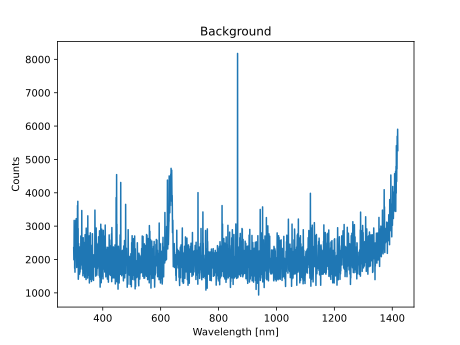
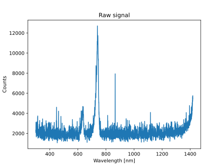
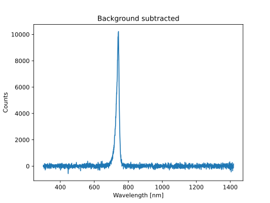
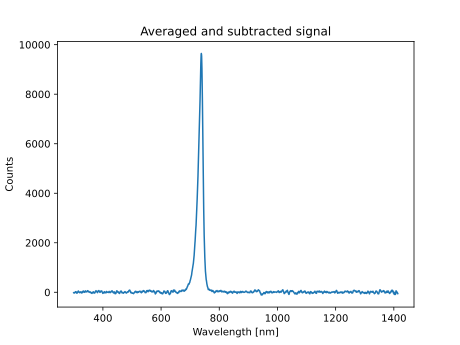
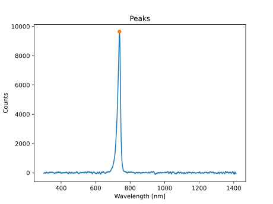

# Example measurement of LC-3IR2-G42 infrared LED

```
avacli measurebg dumpfbg background.dat plotfbg background.png "Background" sleep 10 measure dumpf dataraw.dat plotf dataraw.png "Raw signal" bgsub dumpf datasub.dat plotf datasub.png "Background subtracted" moveavg dumpf dataavg.dat plotf dataavg.png "Averaged and subtracted signal" peaks plotf peaks.png "Peaks" dumpfpeak peaks.dat plot "Peaks"
```

## Recorded background



## Raw signal



## Applied background subtraction



## Applied moving average filter



## Performed peak detection


