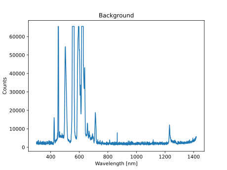
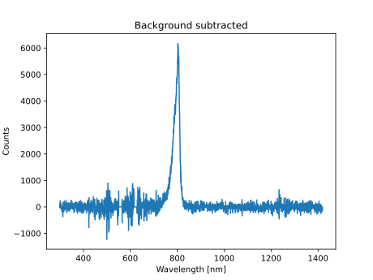
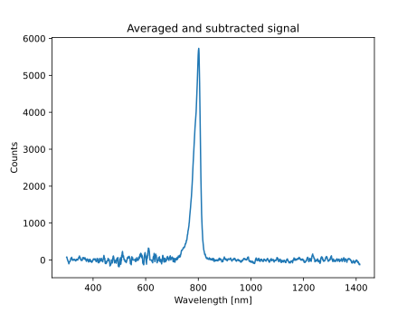
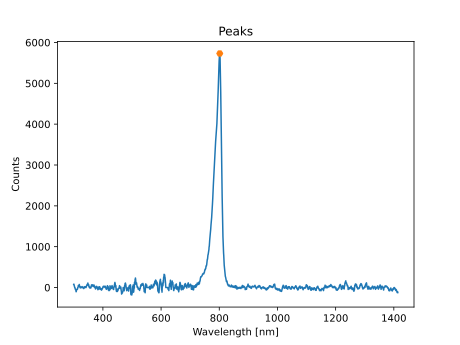

# Example measurement of LC-3IR4-G42 infrared LED

```
avacli --sdg1032xdev 10.0.0.14 --sdg1032xch 2 gateoff measurebg dumpfbg background.dat plotfbg background.png "Background" gateon measure gateoff dumpf dataraw.dat plotf dataraw.png "Raw signal" bgsub dumpf datasub.dat plotf datasub.png "Background subtracted" moveavg dumpf dataavg.dat plotf dataavg.png "Averaged and subtracted signal" peaks plotf peaks.png "Peaks" dumpfpeak peaks.dat plot "Peaks"
```

## Recorded background



## Raw signal


## Applied background subtraction



## Applied moving average filter



## Performed peak detection


